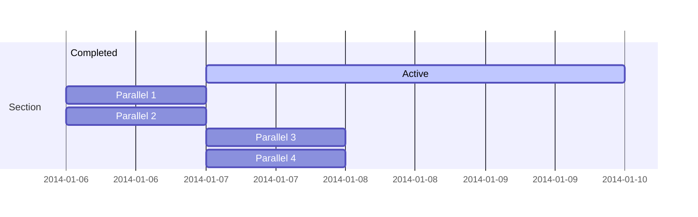

2020년 전북대학교에 입학을 하게 되었습니다.  

## 전북대 정보

전주이씨 종친회와 전북도민들의 모금과 도움으로 1947년 도립이리농과대학으로 개교한 이후 1951년 이리농과대학, 전주 명륜대학, 군산대학을 통합하여 공과대학, 농과대학, 문리과대학, 법정대학, 상과대학을 둔 전북대학교가 발족하였다.

renders as

```markmap {height="200px"}
- 전주캠퍼스 학부
  - 간호대학
  - 공과대학
  - 글로벌융합대학
  - 경상대학
  - 농업생명과학대학
  - 사범대학
  - 사회과학대학
  - 생활과학대학
  - 약학대학
  - 예술대학
  - 의과대학
  - 인문대학
  - 자연과학대학
  - 치과대학
  - 본부직속학부
```

## 전북대 입학 정보

### 입학
유승현은 전북대에 2020년 3월에 사회과학대학 행정학부로 입학하게 된다. 유승현의 학번은 `202013833`이다.


### 전과
유승현은 2024년 사회과학대학 행정학부에서 공과대학 컴퓨터공학부로 전과를 하게 된다.


Hugo Blox supports the _Mermaid_ Markdown extension for diagrams.

An example **Gantt diagram**:

    ```mermaid
    gantt
    section Section
    Completed :done,    des1, 2014-01-06,2014-01-08
    Active        :active,  des2, 2014-01-07, 3d
    Parallel 1   :         des3, after des1, 1d
    Parallel 2   :         des4, after des1, 1d
    Parallel 3   :         des5, after des3, 1d
    Parallel 4   :         des6, after des4, 1d
    ```

renders as



## Todo lists

You can even write your todo lists in Markdown too:

```markdown
- [x] Write math example
  - [x] Write diagram example
- [ ] Do something else
```

renders as

- [x] Write math example
  - [x] Write diagram example
- [ ] Do something else

## Did you find this page helpful? Consider sharing it 🙌
